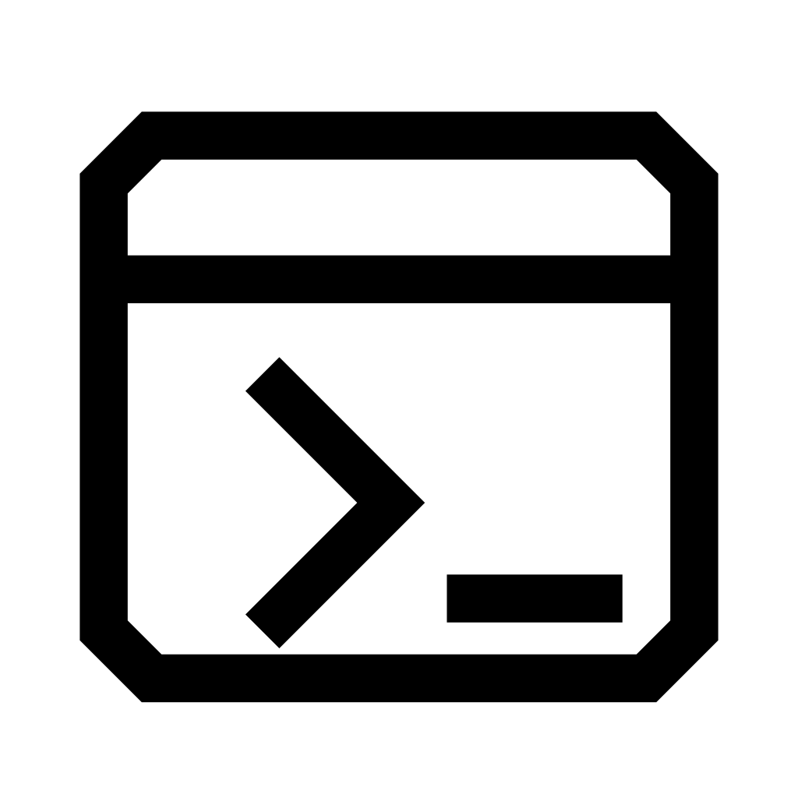

# Codex Jobs App Store Listing

## Listing Metadata

- Name: `Codex Jobs`
- Version: use the published release version from `package.json`
- Category: `Tools & Utilities`
- Release: `Public`
- Support Email: `nick.b.ludwig@proton.me`
- Source: `https://github.com/nick1udwig/codex-pebble`

## App Icon

Use [`assets/codex-jobs-icon.png`](../assets/codex-jobs-icon.png) for the store icon submission.

## Listing Text

Monitor Codex app-server conversations from your Pebble, see live thread updates, and send replies with dictation.

Codex Jobs requires the codex-pebble sidecar running on the same machine as Codex app-server. The sidecar exposes a Pebble-compatible WebSocket relay for the watch app.
